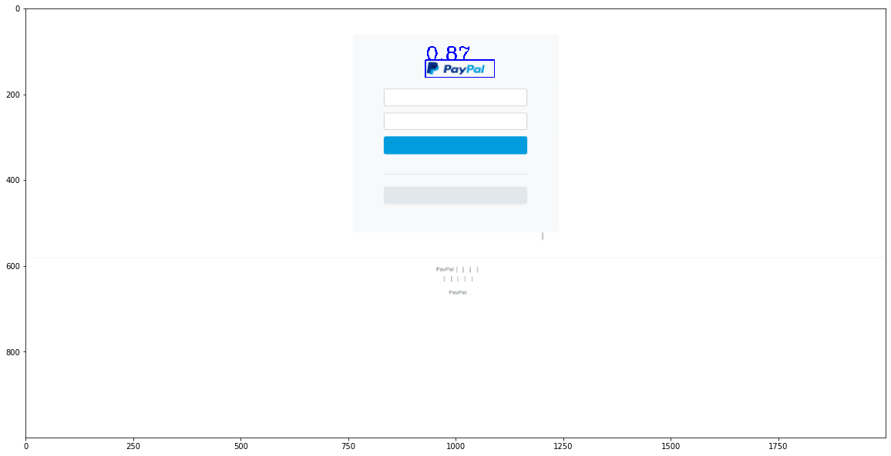

# SVM-HOG-object-detection
A Supported-vector-machine approach for object detection

- Borrowed from https://github.com/SamPlvs/Object-detection-via-HOG-SVM

# Project Structure
```
|
|__data:
|        the training folder(Train_5brand), testing folder(benign_sample_15k and Sampled_phish_5brand), intermediate folder(SVM_imageset)
|__config.py: 
|        the parameters for HOG, sliding window size, common logo size
|__train.py: 
|        training script
|__test.py
|        testing script
|__utils.py
|        neccessary functions (sliding window generation, prediction)
```
# Instructions
- Clone this repository and install requirements
```
    git clone https://github.com/lindsey98/SVM-HOG-object-detection.git
```

- Install requirements
```
    pip install -r requirements.txt
```

- Download data folder from **https://drive.google.com/file/d/1R0SrFBAmFeP4jJoNKOjsJXynfSqKV5ec/view?usp=sharing**
  
- Train a SVM classifier for logo/non-logo patches
``` 
$ python train.py [options/default]
options:
    -d 
        Training screenshots used to create positive samples
        default is data/Train_5brand
    -a 
        Logo position labels for positive samples
        default is data/phish1000_coord.txt
    -o 
        Output directory to save training samples as well as models
        default is data/SVM_imageset
    -b 
        Benign screenshots to create negative samples
        default is data/benign_sample_15k
    -r 
        Ratio of negative samples over positive samples
        default is 3
```

- Test the classifer 
```
$ python test.py [options/default]
    -p 
        path to output file
        default is data/logosense_test.txt
    -f 
        test data folder which contains screenshots
        choose either data/benign_sample_15k or data/Sampled_phish_5brand
    -m
        folder with pre-saved svm models
        default is data/SVM_imageset
```

## Examples 
- PayPal logo is successfully detected from the screenshot
